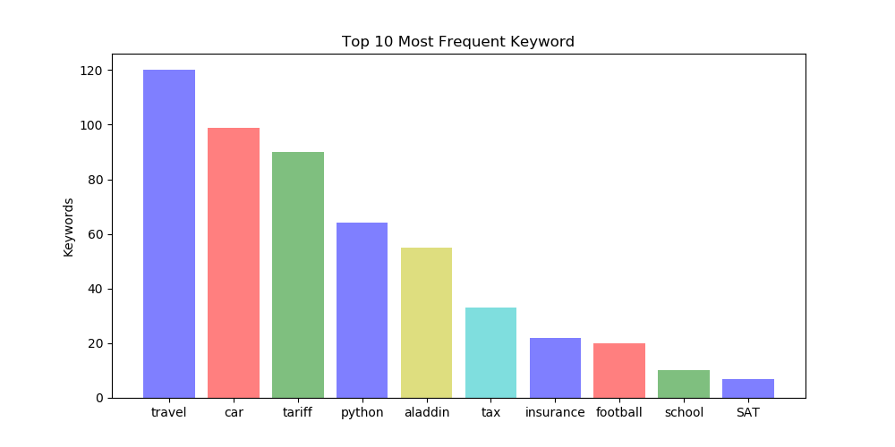

# BDSO-text-analysis
Single post sentiment analysis

### Preparing Deployment environment

To deploy lambda function we use docker container. Check out the docker
project from github: https://github.com/agilebeat-inc/BDSO-docker-serverless

Follow instructions in the Readme.md file for the docker project

### Preparing serverless environment on the docker container

Before we deploy lambda function to the aws we need to execute few preparation
steps. First will be creating virtual environment for python 3.7 where we will
install all packages necessary for the lambda function. Then we will install
serverless plugins necessary for deployment (plugins are extensions allowing more granular
control over aws). Finally we will deploy lambda function.

At this point we are assuming that you have executed the steps listed in the
Readme.md for the BDSO-docker-serverless project. You should have running
docker container and have shell terminal: `root@<IMAGE-ID>:/root/bdso/BDSO-sentiment-analysis#`

#### Step 1. Set python virtual python environment and deploy lambda function

1. Run: `python3 -m venv python.venv`
   This comman will create python virtual environment which is a folder `python.venv`
   insde the project. Please don't check in that folder to the github.

2. Activate python virtual environment. Run command:

   `source python.venv/bin/activate`

   You should see:

   `(python.venv) root@<IMAGE-ID>:~/root/bdso/BDSO-sentiment-analysis#`

3. Install packages necessary for lambda in the virtual environment:

   `pip install vaderSentiment requests nltk gensim pandas matplotlib seaborn`

4. Capture python packages in a file so that serverless will know which
   python packages should be included in zip file containing lambda function

   `pip freeze > requirements.txt`

5. Install necessary plugins for serverless. Run:

   `serverless plugin install -n serverless-python-requirements`

   `serverless plugin install -n serverless-reqvalidator-plugin`

   `serverless plugin install -n serverless-aws-documentation`

   `serverless plugin install -n serverless-plugin-custom-roles`

   *Comment: Serverless plugins are extensions for serverless allowing to get more granula
   control for different cloud providers: aws, asure ...*

6. Finally run deploy command:

   `serverless deploy -v`

#### Step 2. Testing the lambda function

1. Singplep Post analysis:  
The sinplepost function computes whether document contains positive, negative, or positive sentiment 
by scoring it ('VADER' python library is used - *https://www.geeksforgeeks.org/python-sentiment-analysis-using-vader/*).  
The function requires a single document as a parameter ("post content") and returns 
"post", "polarity" (positive/negative/neutral), and sentiment "score".
For example, when the request is provided,     
 >> '{  
&nbsp;&nbsp;&nbsp;&nbsp;&nbsp;&nbsp; "post_content": "I love icecream, so yummy!"  
  }'

>> the function returns  
>>  '{  
 &nbsp;&nbsp;&nbsp;&nbsp;&nbsp;&nbsp;    "post": "I love icecream, so yummy!",  
 &nbsp;&nbsp;&nbsp;&nbsp;&nbsp;&nbsp;    "polarity": "positive",  
&nbsp;&nbsp;&nbsp;&nbsp;&nbsp;&nbsp;     "score": 0.6696  
  }'  
> 
>> The positive and negative "score" value indicates the overall sentiment of 
> the documents is 'positive' or 'negative' respectively, and zero score means 'neutral.'

2. Barplot  
The barplot function presents keywords frequently quoted from the cleaned documents where 
non-critical information such as stopwords, special characters, username etc. is removed and then lemmatized. 

